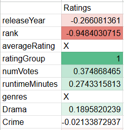
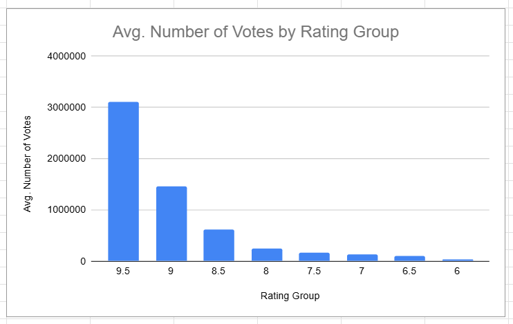
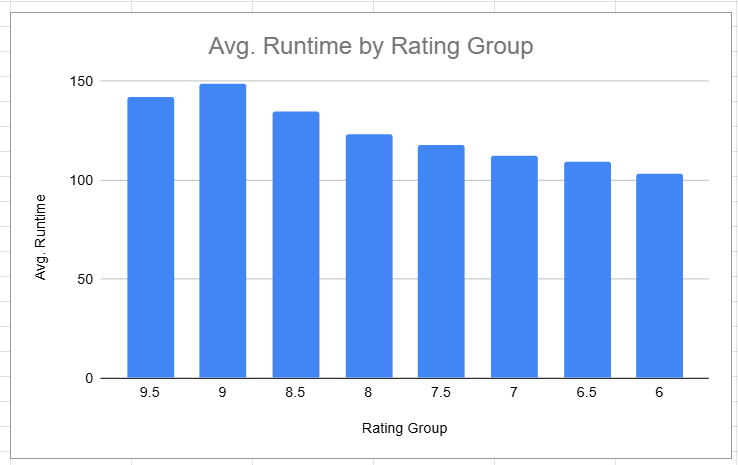
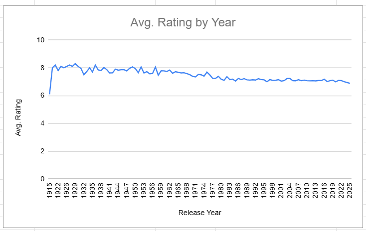
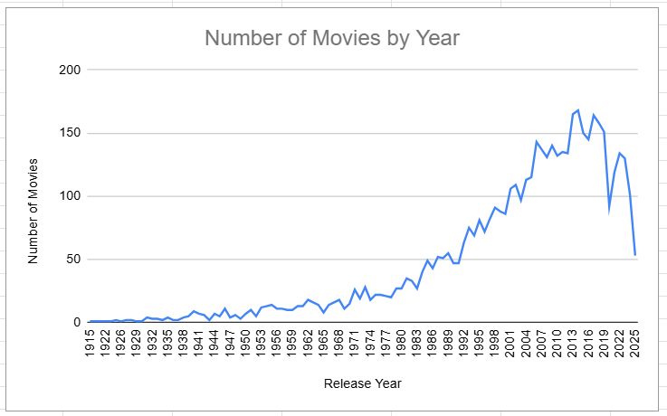
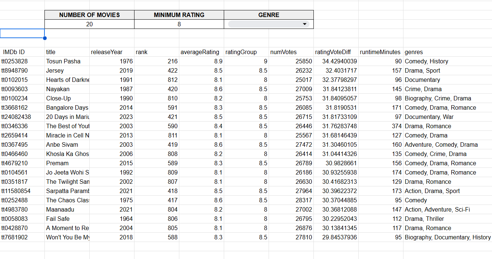

# Movie-Ratings---Analytics

An analysis of 5000 movies aiming to identify patterns in ratings, popularity, and genre.

## Overview
This project analyzes 5000 movies, focusing on their ratings.  
Key questions:
- Are there any factors that correlate with higher ratings?
- Do more votes mean a higher rating?
- Does genre affect ratings?
- Are there any 'underrated' movies?

## Preparing Data
The dataset comes from Kaggle: IMDb Top 5000 Movies.
It contains the IMDb ID, title, year, genre, rating, number of votes, runtime, and other metadata.

Steps taken to prepare the data:
- Load raw file – The CSV was imported into spreadsheets.
- Removed unneeded columns.
- Checked for missing values or values outside of expected ranges.

## Findings
### Ratings Correlations
When running correlations of ratings to other recorded factors, there is a weak to moderate correlation to runtime, number of votes, and release year.       

### Visual Correlations
Putting these on graphs, you can see that the higher-rated movies get significantly more votes on average than the lower-rated movies.
The graph shows that the vote growth is not linear — it appears exponential, suggesting that people are more likely to rate movies they really like.

Runtime also had a weak correlation, and when plotted out there is a more linear but more gradual relation.
There is also a slight decline in the average runtime for the ratings of around 9.5. Suggesting there is probably a "sweet spot" for how long people prefer a movie to be.

### By Year
Grouping by release year shows a slight decrease in average ratings over the years. About a 1 rating drop over 100 years on average.

At the same time, the number of movies released per year has increased dramatically. This suggests that the overall decline in average ratings is likely due to the sheer volume of additional movies, including many lower-rated ones, rather than a true decline in movie quality.

It’s also possible that other cultural and industry factors contribute to these changes. For example, the slight rating decline may reflect audiences becoming more critical over time as expectations evolve.

### Underrated Movies
To find underrated movies, I looked for movies with a high score and a low number of votes. These movies scored well but received little attention. Filtering by genre and minimum rating made it easier to explore different categories.

## Tools Used
- **Spreadsheets**: for data cleaning, processing, analysis, and visualization
- **SQL Query**: for data pocessing

